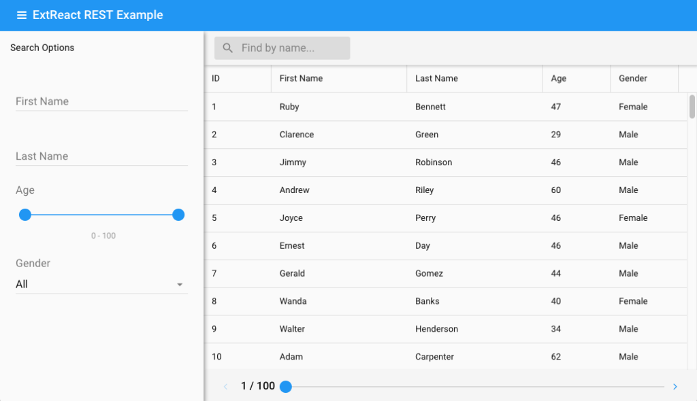

# Using Ext.data.Store Within Flux Apps

Both ExtReact and [Flux](https://facebook.github.io/flux/) use the term “store”. ExtReact’s `Ext.data.Store` class provides high performance 
data retrieval, paging, sorting, and filtering for components that display large sets of records such as 
`Grid`, `Tree`, and `List`. `Ext.data.Store` should not be confused with the concept of a store in Flux. 
A Flux store is an observable data structure that holds the state of your application. To illustrate the 
relationship between these two data structures and how to best connect them, let’s use the popular 
[Redux](https://github.com/reactjs/redux) library as an example.

Consider the following UI from the [ExtReact REST Example](https://github.com/sencha/ext-react/tree/master/packages/ext-react-rest-example), which 
contains a `Grid` and a set of search criteria.

When search criteria change, we apply a filter to the grid’s store using 
the [[modern:Ext.data.Store#method-filter filter]] method.  The store either filters the 
data in memory, or if a remote proxy is configured, forwards the filter criteria to the 
server in a fetch request.

There are two possibilities for where an Ext.data.Store should live in an app that 
uses Redux.

## Option 1: In the Redux Store

The `Ext.data.Store` instance bound to our `Grid` can reside in the application state 
stored by Redux.  When filter criteria change, we apply a new filter to the store in our reducer:

**reducer.js**

  import { UPDATE_CRITERIA } from './actions';
  
  const initialState = {
      employeesStore: new Ext.data.Store({
          ...
      })
  }

  export default function reducer(state = initialState, action) {
    switch(action.type) {
      case UPDATE_CRITERIA:
        const { criteria } = action;
        const filters = [];

        for (let name in criteria) {
          filters.push({
            property: name,
            value: criteria[name]
          })
        }

        state.employeesStore.filter(filters);
        return { ...state };
    }
  }

In this scenario our `Grid` component can be implemented as a stateless component (a function instead of a class that extends `React.Component`).  We connect it 
to the redux store using the `connect` function from `react-redux`:

**EmployeesGrid.js**

  import React from 'react';
  import { Grid } from '@sencha/ext-modern';    
  import { connect } from 'react-redux';
  
  function EmployeesGrid({ store }) {
    return (
      <Grid 
        store={store}
        ...
      />
    )
  }
  
  const mapStateToProps = (state) => {
    return { store: state.employeesStore }
  };
  
  export default connect(mapStateToProps)(EmployeesGrid);

Redux state is a convenient place for the `Ext.data.Store` instance for two reasons:

1. You can easily make the store available to multiple components.  For example, you might 
want to use the same store on both a Grid and a Chart to provide two different views of 
the same data.

2. The grid component can be implemented as stateless component because all of the logic 
related to filtering the store resides in our reducer.

This design, however, doesn't follow the best practice of making Redux states immutable.  Some 
developers may not be comfortable with this approach.  There are interesting discussions about 
storing mutable objects within Redux state [here](https://github.com/reactjs/redux/issues/606) 
and [here](https://github.com/reactjs/redux/issues/1279). As you might expect opinion is split 
on the topic.  Some developers find this approach to be expedient and have no meaningful side 
effect, and some prefer their Redux state to remain strictly immutable. 

## Option 2: In Component State

If we wish to preserve the immutability of our Redux state, we can instead store only the 
individual criteria in application state, and have our `EmployeesGrid` component manage the 
`Ext.data.Store` using lifecycle methods.  With this design our reducer looks like:

**reducer.js**

  import { UPDATE_CRITERIA } from './actions';
  
  const initialState = {
    criteria: { }
  }
  
  export default function reducer(state = initialState, action) {
    switch(action.type) {
      case UPDATE_CRITERIA:
        const { criteria } = action;
        return { ...state, criteria };
    }
  }

We shift the responsibility for managing our `Ext.data.Store` to the EmployeesGrid component:

**EmployeesGrid.js**

  import React, { Component } from 'react';
  import { Grid } from '@sencha/ext-modern';
  import { connect } from 'react-redux';
  import PropTypes from 'prop-types';
  
  class EmployeesGrid extends Component{
    static propTypes = {
      criteria: PropTypes.object
    };

    store = new Ext.data.Store({
      ...
    });

    componentDidUpdate(prevProps) {
      const { criteria } = this.props;

      if (prevProps.criteria !== criteria) {    
        const filters = [];

        for (let name in criteria) {
          filters.push({
            property: name,
            value: criteria[name]
          })
        }
        this.store.filter(filters)
      }
    }

    render() {
      return (
        <Grid 
          store={this.store}
          ...
        />
      )
    }
  }
  
  const mapStateToProps = (state) => {
      return { criteria: state.criteria }
  };
  
  export default connect(mapStateToProps)(EmployeesGrid);

This approach has several benefits:

* Our redux state objects remain immutable, in keeping with the best practice.

* Our reducer is a pure function, and deals only with plain JS objects.

* The implementation details of our integration with Ext.data.Store are nicely hidden 
within our component.  In this way, toolkit-specific API calls are confined to the 
component that needs them (EmployeesGrid).

## Conclusion

In our opinion both approaches have their merits, but option #2 (putting `Ext.data.Store` 
in component state) is more in keeping with the spirit of Redux.  In scenarios where stores 
need to be accessed by multiple components, such as a grid and a chart, we recommend 
creating a parent component that contains both and manages the store using lifecycle methods.  

You can see a full example of this approach in the 
[ext-react](https://github.com/sencha/ext-react/tree/master/packages/ext-react-rest-example) repo. 

