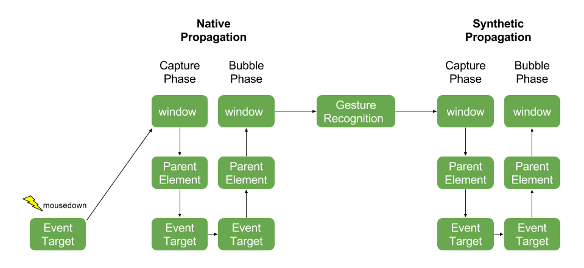
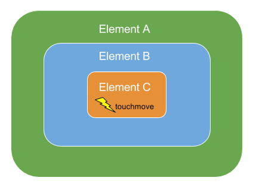
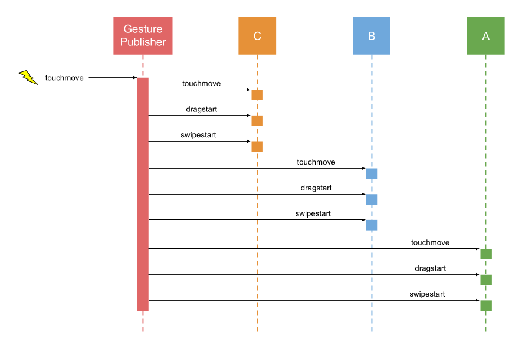
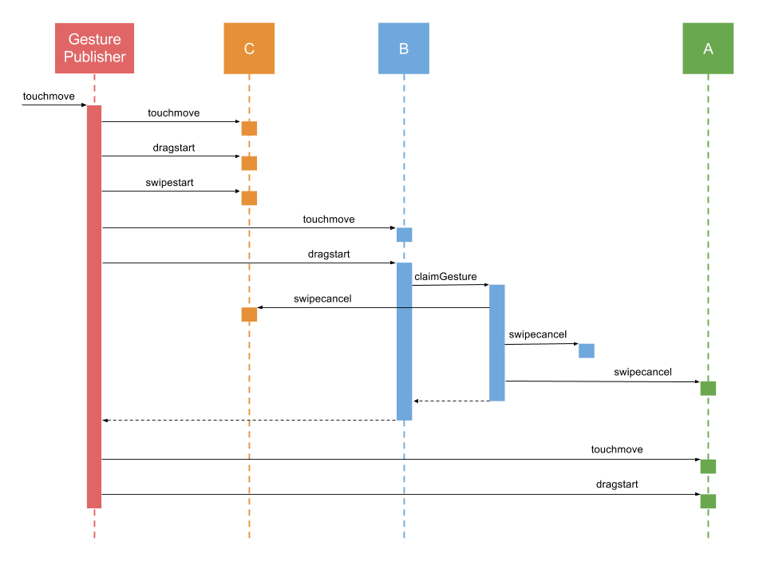

# Gestures

In addition to standard events, Elements also fire synthesized "gesture"
events. From a browser's perspective, there are 3 primary types of pointer,
touch, and mouse events - start, move, and end:
<table>
	<tr>
		<th>Event</th>
		<th>Touch</th>
		<th>Pointer</th>
		<th>Mouse</th>
	</tr>
	<tr>
		<th>Start</th>
		<td>touchstart</td>
		<td>pointerdown</td>
		<td>mousedown</td>
	</tr>
	<tr>
		<th>Move</th>
		<td>touchmove</td>
		<td>pointermove</td>
		<td>mousemove</td>
	</tr>
	<tr>
		<th>Stop</th>
		<td>touchend</td>
		<td>pointerup</td>
		<td>mouseup</td>
	</tr>
</table>

Upon interpreting the sequence and timing of these events, the framework
can synthesize more complex events such as `drag`, `swipe`, `longpress`,
`pinch`, `rotate`, and `tap`. Ext JS applications can listen for gesture
events just like any other event, for example:

	Ext.get('myElement').on('longpress', handlerFunction);

By intercepting all 3 types of events, mouse, pointer, and touch, Ext JS
allows any gesture to respond to any type of input. This means not only
that all gestures can be triggered using touch input, but all single-point
gestures (`tap`, `swipe`, etc.) can be triggered using a mouse as well. This
results in a gesture system that works seamlessly across devices regardless
of input type.

Ext JS currently supports the following gestures:
<table>
	<tr>
		<th>Gesture</th>
		<th>Events</th>
    </tr>
	<tr>
		<td>Tap</td>
		<td>tap, tapcancel</td>
    </tr>
	<tr>
		<td>DoubleTap</td>
		<td>singletap, doubletap</td>
    </tr>
	<tr>
		<td>LongPress</td>
		<td>longpress</td>
    </tr>
	<tr>
		<td>Drag</td>
		<td>dragstart, drag, dragend, dragcancel</td>
    </tr>
	<tr>
		<td>Swipe</td>
		<td>swipestart, swipe, swipecancel</td>
    </tr>
	<tr>
		<td>Pinch</td>
		<td>pinchstart, pinch, pinchend, pinchcancel</td>
    </tr>
	<tr>
		<td>Rotate</td>
		<td>rotatestart, rotate, rotateend, rotatecancel</td>
    </tr>
	<tr>
		<td>EdgeSwipe</td>
		<td>edgeswipe, edgeswipestart, edgeswipeend, edgeswipecancel</td>
	</tr>
</table>

## Pointer Type

In some cases applications need to listen for a gesture only when triggered
by a specific type of input (mouse or touch) while ignoring the other.
Ext JS provides a [[ext:Ext.event.Event#pointerType pointerType]] property
on event objects for detecting the type of input that caused the event:

    el.on('drag', function(e) {
        if (e.pointerType === 'touch') {
            // only handle touch-drag, and ignore mouse-drag
        }
    });

## Event Propagation

Events propagate through the framework in much the same way that DOM events
propagate naturally in a browser.  The difference is that the framework
uses a delegated event model in order to support gesture recognition.
This means that events are delivered to DOM elements in a separate propagation
phase that occurs after the event has already completed propagation at the
DOM level.

## Native Propagation
Event listeners that are directly attached to a DOM element will be invoked
as the browser propagates the event through the DOM hierarchy.  While it is
helpful to understand the mechanics of native propagation, directly-attached
DOM listeners in Ext JS should generally be avoided for the following reasons:

* Direct listeners fire out-of sequence with other listeners
* Calling `stopPropagation` from a directly attached listener can prevent
gesture recognition from occurring, and prevent the synthetic propagation
that follows.

In some cases, however, it may be necessary to attach a listener directly
to a DOM element, for example, to work around an issue when using Ext JS
together with other frameworks.  This can be done using the `delegated`
event option.

    el.on({
        mousedown: function() {
            Ext.Msg.alert('mousedown fired - native capture phase');
        },
        // careful when using delegated: false! this can have unintended side effects
        delegated: false,
        // use the capture option to listen in the capture phase
        capture: true
    });

DOM-level propagation occurs in two phases.  First is the capture phase
in which the event is dispatched to each element from the top of the dom,
starting with the window object, all the way down to the element that was
the target of the event.  After the capture phase the bubble phase occurs
in which the event is delivered first to the target element, then to its
ancestors until it reaches the top of the hierarchy.  By default listeners
are fired during the bubble phase of propagation, but interested parties
can listen in the capture phase using the `capture` event option.

## Gesture Recognition

After the native event bubbles up to the window object, Ext JS performs
gesture recognition.  It may then synthesize one or more gesture events
which then must be propagated throughout the DOM.

## Synthetic Propagation

After the gesture recognition step is complete, the Framework will dispatch
the original DOM event, such as `mousedown` or `touchmove` along with any
gesture events, such as `drag` or `swipe` that were recognized as a result
of the DOM event.  Like native propagation, synthetic propagation also
happens in two phases, a capture and a bubble phase.

Synthetic Propagation is the default for all event listeners within the
framework and is recommended for applications using Ext JS.   Using synthetic
propagation ensures that the event fires in proper sequence with other events
and avoids surprises when propagation is stopped for some reason.  Developers
do not need to do anything to enable synthetic propagation - the following
listener uses synthetic propagation:

    el.on('mousedown', function() {
        Ext.Msg.alert('mousedown fired - synthetic bubble phase');
    });

Once again, the `capture` option can be used to listen in the capture phase:

    el.on({
        mousedown: function() {
            Ext.Msg.alert('mousedown fired - synthetic capture phase');
        },
        capture: true
    });

## Stopping Propagation

Propagation can be stopped at any point during native or synthetic propagation, in either
the capture or bubble phase. This prevents the event from being dispatched to any elements
that have not yet received it, and prevents any pending capture or bubble phases from executing.

For example stopping propagation while the event is being dispatched to an element will
prevent the event from bubbling up to that element’s parent:

    parentEl.on('mousedown', function() {
        // never fires because child element in bubble phase stops propagation of mousedown
        Ext.Msg.alert('mousedown fired on child');
    });

    el.on('mousedown', function(e) {
        Ext.Msg.alert('mousedown fired on child');

        // immediately stop propagating the event any further
        e.stopPropagation();
    });

Stopping propagation during the capture phase cancels the entire bubble phase.

    el.on({
        mousedown: function(e) {
            Ext.Msg.alert('mousedown - capture phase');

            // stopping propagation during the capture phase causes the entire
            // bubble phase to be skipped
            e.stopPropagation();
        },
        capture: true
    });

    el.on('mousedown', function() {
        // never fires because propagation of mousedown event was stopped prior to
        // bubble phase
        Ext.Msg.alert('mousedown - bubble phase');
    });

## Gesture Propagation

When a gesture event is recognized it propagates through the DOM hierarchy
along with the native event from which it was synthesized.  In some cases
recognition of multiple gestures can occur simultaneously.  When this
happens the gestures propagate together in a single set of capture/bubble
phases.

For example consider a DOM hierarchy where element "A" contains element
"B", which contains element "C".  Suppose a touchmove event fires on the
innermost element, "C", and this touchmove event meets the criteria for
both `drag` and `swipe` gestures.

Upon recognizing that both a `drag` and a `swipe` are occurring, the
Gesture Publisher publishes the touchmove, dragstart, and swipestart events,
and delivers all three events to each element in the hierarchy.

## Claiming a Gesture

Sometimes elements in the same hierarchy can be listening for conflicting
gestures.  In the above example, imagine that Element A is listening for
`swipe` and its child, element B, is listening for `drag`.   When element B
handles the dragstart event, it may want to prevent the current gesture
from being interpreted as a swipe, since element A’s swipe handler may
interfere with element B’s drag handler.   To do this it must "claim" the
drag gesture by invoking the claimGesture method on the event object.

    el.on('dragstart', function(e) {
        e.claimGesture();
    });

Once claimGesture has been invoked on the dragstart event object, the
gesture is considered to be a `drag` gesture for the remainder of its
duration (until the user lifts their finger or releases the mouse button).
All events associated with the `swipe` gesture (swipestart, swipe, swipeend)
will cease to fire.  Additionally, since the swipe event was cancelled, a
`swipecancel` event will be delivered to each element in the propagation
hierarchy.

## Browser-Handled Gestures (Touch Actions)

Browsers handle certain touch gestures automatically and perform default
actions in response such as scrolling or zooming.  These actions are referred
to as "touch actions".  Browsers typically implement the following touch
actions:
<table>
	<tr>
		<th>Gesture</th>
		<th>Touch Action</th>
    </tr>
	<tr>
		<td>drag (horizontal)</td>
		<td>horizontal scroll</td>
    </tr>
	<tr>
		<td>drag (vertical)</td>
		<td>vertical scroll</td>
	</tr>
	<tr>
		<td>pinch</td>
		<td>zoom</td>
	</tr>
	<tr>
		<td>doubletap</td>
		<td>zoom</td>
	</tr>
</table>

Ext JS applications that implement their own handling for any of these
gestures may need to disable one or more of the browser's default touch
actions while the gesture is being handled.  For example a draggable
element most likely will want to prevent scrolling of its container
while it is being dragged.  This can be achieved by setting the
[[ext:Ext.dom.Element#setTouchAction touchAction]] of the element.

    // instruct the browser not to scroll while "el" is being dragged
    el.setTouchAction({
        panX: false,
        panY: false
    });

The concept of touch action within Ext JS is modeled after the CSS
`touch-action` property and supports the same values. Under the hood the
framework uses CSS `touch-action` where supported (on browsers that implement
[Pointer Events](https://www.w3.org/TR/pointerevents/)), and emulates
the same behavior on [Touch Events](https://www.w3.org/TR/touch-events/)
browsers.
<table>
	<tr>
		<th>CSS Name</th>
		<th>Ext JS Name</th>
	</tr>
	<tr>
		<td>pan-x</td>
		<td>panX</td>
	</tr>
	<tr>
		<td>pan-y</td>
		<td>panY</td>
	</tr>
	<tr>
		<td>pinch-zoom</td>
		<td>pinchZoom</td>
	</tr>
	<tr>
		<td>double-tap-zoom</td>
		<td>doubleTapZoom</td>
	</tr>
</table>

When dealing with Components one should generally avoid calling
`setTouchAction` directly on their elements, and instead use the Component's
[[ext:Ext.Component#touchAction touchAction]] config instead.  For example
the following panel's main element does not allow the browser to vertically
scroll, and its body element does not allow pinch-to-zoom or vertical scroll
since it inherits the touchAction of its parentNode via the DOM.

    touchAction: {
        panY: false,
        body: {
            pinchZoom: false
        }
    },
    listeners: {
        drag: function(e) {
            // handle drag on the panel's main element
        },
        pinch: {
            element: 'body',
            fn: function(e) {
                // handle pinch on the panel's body element
            }
        }
    }

## Longpress to Drag

On touch devices, it can sometimes be difficult to determine if a touch
should scroll or drag an object. A common way to determine the intent is
a time threshold. Press on the element for long enough and the gesture
transforms into a drag instead of a scroll. This can now be accomplished
using the new `startDrag` method available on `longpress` events.

    el.on('longpress', function(e) {
        e.startDrag();
    });

On [Pointer Events](https://www.w3.org/TR/pointerevents/) browsers (IE
and Edge) one must also set the appropriate touch action on the element
to prevent the browser from scrolling while the element is being dragged:

    el.setTouchAction({
        panX: false,
        panY: false
    });

On [Touch Events](https://www.w3.org/TR/touch-events/) browsers (Chrome
and Safari) it is not necessary to configure the touch action of the element
in order to prevent scrolling.  Instead, one could call `preventDefault`
on the drag event object to prevent scrolling from occurring:

    el.on('drag', function(e) {
        e.preventDefault();
    });

While the `preventDefault` approach to preventing scrolling does not work
on Pointer Events browsers, on Touch Events browsers it has the advantage
of allowing the determination of whether or not to scroll to be made
at run-time, rather than having to specify a touch action up front.
For apps that only need to support Touch Events browsers this can
be a useful technique, however, for cross-platform apps one must use
`touchAction` to prevent scrolling.

## Viewport Zoom

This guide assumes that viewport zoom is enabled in your app.  This is
typically done by adding the following meta tag to your html page:

    <meta name="viewport" content="width=device-width, initial-scale=1, maximum-scale=10, user-scalable=yes">

Applications that wish to disable viewport zoom should replace that
meta tag with the following:

    <meta name="viewport" content="width=device-width, initial-scale=1, maximum-scale=1, user-scalable=no">

We recommend always enabling viewport zoom, as it improves accessibility
for users that are visually impaired.
