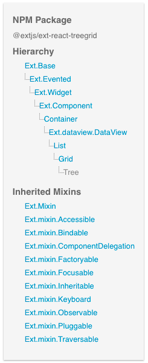

# Importing Components and Other Classes from ExtReact

## Components 

All ExtReact components can be imported from one of the `ext-react` packages using ECMAScript module syntax.  For example:

```JavaScript
import { Panel, Button } from '@sencha/ext-modern';
```

The package in which each component resides is documented on the right-hand side of that component's page in the API docs.  For example, here is an excerpt from the docs for the `Tree` component:



## Other Classes

Non-component classes such as plugins, proxies, readers, and others can be included in the build by adding an `Ext.require(className)` call to your code.  This can appear anywhere in your app, but we recommend putting
it in the file in which each class is used.

For example, to include the gridcellediting plugin:

```JavaScript
import React from 'react'
import { Grid, Column } from '@sencha/ext-modern';

Ext.require('Ext.grid.plugin.CellEditing');

export default function MyGrid({ store }) {

  return (
    <Grid plugins={['cellediting']} store={store}>
      ...
    </Grid>
  )

}
```

To include multiple classes in the build, pass an array to `Ext.require()`:

```JavaScript
Ext.require([
  'Ext.grid.plugin.CellEditing',
  'Ext.grid.plugin.Exporter'
])
```

Calls to `Ext.require()` are only used during the build process and are removed from the resulting bundle.