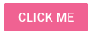
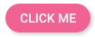

# Theming

## Overview

ExtReact includes a theming API that allows you to configure the look and feel of components.  This guide explains the basics of the ExtReact theming API and walks you through the process of creating a custom theme.

## Using Themer
Custom themes for ExtReact can be created without writing code using [Sencha Themer](https://www.sencha.com/products/themer/).
Rest of this guide is targeted to those who are creating themes manually i.e. not using Themer.

## Using a Built-in Theme

ExtReact contains several built in themes:

| Theme                   | Description                                          |
|-------------------------|------------------------------------------------------|
| ext-modern-theme-material                             | Material theme for the Modern toolkit .                               |
| ext-modern-theme-ios                      | Modern iOS Theme                               |
| ext-modern-theme-neptune                          | Modern borderless theme                               |
| ext-modern-theme-triton                           | Modern flat, borderless theme  
|                   |             |                                |
| ext-classic-theme-classic                      | classic blue Ext JS theme                               |
| ext-classic-theme-neptune                      | Borderless theme                               |
| ext-classic-theme-neptune-touch                | Neptune-Based Touch Theme                               |
| ext-classic-theme-triton                            | Flat, borderless theme                               |
| ext-classic-theme-crisp                              | Minimalistic Theme                               |
| ext-classic-theme-crisp-touch                         | Crisp-Based Touch Theme                               |
| ext-classic-theme-graphite                            | Accessible theme based on Triton                               |
|                   |             |                                |


Set the theme for your application using the ExtReact webpack plugin:

```javascript
// example webpack.config.js

const ExtReactWebpackPlugin = require('@sencha/ext-react-webpack-plugin');

module.exports = {
  ...
  plugins: [
    new ExtReactWebpackPlugin({
      theme: 'theme-material' // this is the default
      port:port,
    })
  ]
  ...
}
```

## Creating a Custom Theme

Built-in themes can be extended to create a custom theme. With the `@sencha/ext-react` package installed, you can create a custom theme by running the following command:

```bash
npx ext-react generate theme --name <theme-name> --baseTheme <theme-material|theme-ios|theme-triton (optional, defaults to theme-material)>
```
This will create a new custom theme in `ext-react/packages/<theme-name>`. 

For example, to create a new theme called "my-theme" which extends the material theme, you would run:

```bash
npx ext-react generate theme --name my-theme
```
Apply the theme to your app by updating your ExtReactWebpackPlugin settings:

```javascript
new ExtReactWebpackPlugin({
  theme: './ext-react/packages/<theme-name>' // this is the default
})
```

*Note: theme-triton and theme-ios are separate npm packages that are not included with ExtReact by default.  You can install them by running:

```
npm install --save @sencha/ext-modern-theme-triton @sencha/ext-modern-theme-ios
```

## Customizing Your Theme

### Syntax and Directory Structure

An ExtReact theme is made up of files that use the Fashion syntax, Sencha's own dialect of SASS.  Files use the .scss extension and are organized in the following directory structure:

```
/sass
  /etc
  /src
  /var
```

#### etc

The `etc` directory contains additional utility functions or mixins.  The all.scss file is automatically included in the build if present.  Additional files can be included via an `@import` directive or added to the theme's package.json under sencha/sass/etc.

#### src

The `src` directory contains rules and UI mixin calls that can use the variables defined in sass/var/.  File paths correspond to ExtReact namespaces and are only included in the build if the corresponding class is used in your application. The namespace for each component can be found in the [API documentation](http://docs.sencha.com/extreact/6.5.0).  For example, to define a ui for a `List`, which has a fully qualified name of `Ext.dataview.List`, create:

```
/sass
  /src
    /Ext
      /dataview
        List.scss
```      

In addition to including files based on fully-qualified name, you can also add individual files to the theme's `package.json`, under `sencha.sass.src`, or use the `@import` directive.

#### var

The `var` directory contains global variables. As with `src`, file paths correspond to the component namespaces. In addition to including files based on fully-qualified name, you can add individual files to the theme's `package.json`, under `sencha.sass.var`, or use the `@import` directive.

### Setting Global Variables

The best way to start customizing a theme is to set the values of global variables.  Each component has it's own set of global variables that affect the look and feel of all instances of that component. For example, we can change the font-family for Panel headers by creating:

```
/sass
  /var
    /Ext
      /Panel.scss
```

...and adding the following content...

```sass
// Panel.scss
$panel-header-font-family: 'Comic Sans';
```

In addition to the variables provided for each component, there are a number of variables that affect all components.  These are listed in [Global_CSS](http://docs.sencha.com/extreact/6.5.0/modern/Global_CSS.html) in the API documentation.

For example, to set a new $base-color for the theme, create:

```
/sass
  /var
    /Ext
      /Component.scss
```

...and add the following content...

```sass
// Component.scss
$base-color: #025B80;
```

Some developers may prefer to put all of their global variables in a single file.  This can be done by simply putting them all in `var/Ext/Component.scss` or by creating a file of your choice and adding it to `sencha.sass.var` in the theme's `package.json`.

### Adding UIs

Each component can be configured with a `ui` prop that accepts the names of one or more uis used to style the component.  UIs are essentially a set of css classes created using mixins provided by the theming API.  UIs are defined in the theme's sass/src directory. For example, if we wanted to create a button that looked like this:



We could do so by creating:

```
/sass
  /src
    /Ext
      /Button.scss
```

...and adding the following content...

```sass
// Button.scss
@include button-ui(
  $ui: 'pink',
  $background-color: #E91E63,
  $color: white
)
```

We would then apply the "pink" ui to Buttons as follows:

```jsx
<Button ui="pink" text="Click Me"/>
```

Components can be configured with multiple UIs.  For example, we can add the built-in `round` and `raised` uis to make our button round and raised:

```jsx
<Button ui="pink round raised" text="Click Me"/>
```



### Big Mode

Many variables and ui mixin parameters have a corresponding variable or parameter with the suffix `-big`.  The `-big` variables take effect when the `x-big` css class is applied to the html body element.  This automatically occurs when your application is viewed on a mobile device (tablet or phone).  The variables without the `-big` suffix take effect when the application is viewed on the desktop.

### Further Reading

[Theming in the Modern Toolkit](http://docs.sencha.com/extjs/6.2.1/guides/core_concepts/modern_theming.html)
